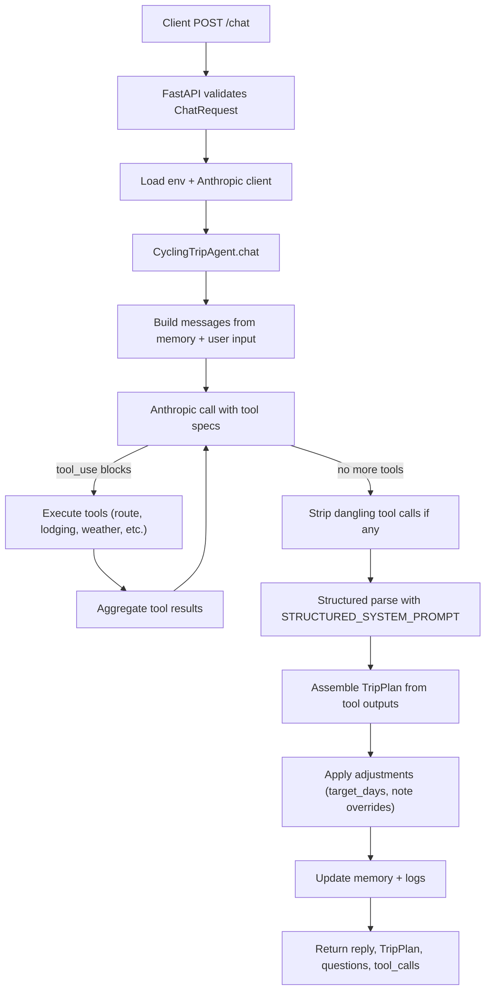

# Flow of Code

1) **API entry (`src/api/main.py`):** FastAPI loads env vars, constructs an Anthropic client (if `ANTHROPIC_API_KEY` is set), and instantiates `CyclingTripAgent`. Incoming `POST /chat` requests are validated and forwarded.
2) **Message prep:** Agent pulls prior conversation history and state from `InMemoryConversationMemory`, appends the new user message, and logs the event.
3) **Tool-enabled LLM call:** Anthropic Messages API is invoked with `TOOL_SYSTEM_PROMPT` plus tool specs derived from Pydantic schemas. The agent inspects returned blocks for `tool_use`.
4) **Tool execution:** Each requested tool is validated and executed. Results (or validation/execution errors) are sent back to the model as `tool_result` messages. Supported tools live in `src/tools/*` and lean on external lookups when available.
5) **Loop control:** The tool loop runs up to four main rounds with two cleanup passes; dangling `tool_use` blocks are stripped before structured parsing to avoid parser failures.
6) **Structured parse & assembly:** A final call to Anthropic (with `STRUCTURED_SYSTEM_PROMPT`) requests a `ChatLLMResponse`. Independently, the agent assembles a `TripPlan` from gathered tool outputs, filling missing budget data if needed.
7) **Adjustments:** If the structured response includes `adjustments` (e.g., `target_days`, per-day note overrides), they are applied to the `TripPlan`.
8) **Memory update:** Assistant reply and user message are persisted to memory; a plan summary is cached in state for future turns.
9) **Response:** API returns `conversation_id`, concise `reply`, optional `triplan`, clarifying `questions`, and any declared `tool_calls`.

## Mermaid Flow Diagram

